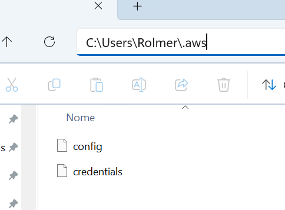

## Finalidade
A finalidade desse projeto é provar o conceito de acesso ao IAM da AWS, utilizando SDK

## Requisitos
É necessário ter as credenciais da AWS definidas e válidas no arquivo credentials da pasra .aws do usuáruio atual

Também é necessário que o usuário iam, cujas credenciais estão sendo utilizadas, poessua permissão para realizar leitura de iam

